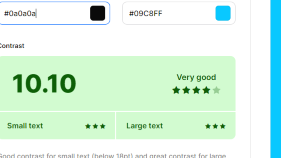

# Silly-Duko

## Welcome to <a href="https://peter-hennessy.github.io/silly-doku/" target="_blank" rel="noopener">Silly-Duko</a> A Board Game with a Twist

The idea for my project comes from a game I like to play myself, but I decided to add numbers and letters as a mix to excercise the brain more during game play.
During the game the user must decipher the correct number and letter to be placed in the correct box.
Not at any point shall the same number be duplicated in the Same line or section. The player has a choice of three levels, three timers, which again can add to the challenge of the game. I have also given the choice of two themes. 

# Contents

* [**User Experience UX**](<#user-experience-ux>)
    *  [User Stories](<#user-stories>)
    * [Wireframes](<#wireframes>)
    * [Game Structure](<#game-structure>)
    * [Design Choices](<#design-choices>)
    
* [**Features**](<#features>)
    * [**Home**](<#challenge-menu>)
         * [Choose Level](<#home>)
         * [Timer](<#home>)
         * [Choose Them](<#home>)
         * [Board Game](<#home>)
         * [Rules](<#request-demo>)

         
* [**Technologies Used**](<#technologies-used>)
* [**Testing**](<#testing>)
* [**Deployment**](<#deployment>)
* [**Credits**](<#credits>)
* [Content](<###content>)
*  [**Acknowledgements**](<#acknowledgements>)

# User Stories
- As a user I want to be able to be drawn into the page
- As a user I need to be able to see clearly understand where I want to go
- As a user I need to be able to see text and images clearly
- As a user I need to be able to understand the rules of the game
- As A user I need to want to return to the game after the initial game is finished

# Wireframes

 [Top](<#contents>)

# Game Structure
* For the game I decided to create a board with both numbers and letters. The board is made up of the traditional 81 squares
* There is a timer to add to the challenge with a choice of 5 minutes, 10 minutes or 15 minutes
* Lives are displayed at the top of the board and each time an incorrect selection is made, a life is lost

 [Top](<#contents>)

# Design Choices 

- ### Typography
For my project I decided to choose two fonts, Archivo as the text font and Roboto as the contrasting heading font with a default font of Sans-Serif. 
* 'Archivo' The Reason I chose this contrasting style is because the reading text is clear for the user to see. 
* 'Roboto' is used for the heading text which looks solid prominent and straight, which I feel adds a nice contrast when the user is reading the page

- ### Color Scheme
For this project I decided on a traditional color scheme of #0a0a0a which in a very _Dark Gray (mostly black)_ and #fff which is a _White_, and rgb(9,200,255) which is a shade of _Teal_  for the dark theme. 

To Check The Contrast between **Text** and **Background**  on both the **light & Dark**I used [Color Contrast](https://coolors.co/contrast-checker/112a46-acc8e5)

  

 [Top](<#contents>)
# Features
### Challenge Menu
This is situated in the upper section of the page Starting left to right this includes the following: 
- Choose level depending on the knowledge of the game the use has
- Once the player selects the desired level and time they then hit the **Let's Play** button which will start the game
- Choose a time to add to the challenge of the game, if the time runs out before the game is complete then  **Game Over!!!**

- #### Home 
 
- In Image 1 the user is greeted by a screen with level, time, and theme options. The rules are at the bottom of the page. Once the user selected the desired option, reads the rules , then they press the **Let’s Play** button.
- In Image 2 the game appears with the clock counting down, and the lives clearly displayed

- #### Footer
On the Footer of the page the rules are outlined to explain to the player how the game works

 # Future Features

 - In the future I would like to create a game where the numbers were pre selected using a specific algorithm, At the moment the game only has 3 boards with content, But it has 3 time levels which may add to the challenge

 [Top](<#contents>)

 
 
# Technologies Used
* [HTML5](https://html.spec.whatwg.org/) - provides the content and structure for the website.
* [CSS](https://www.w3.org/Style/CSS/Overview.en.html) - provides the styling.
* [Balsamiq](https://balsamiq.com/wireframes/) - used to create the wireframes.
* [Gitpod](https://www.gitpod.io/#get-started) - used to deploy the website.
* [Github](https://github.com/) - used to host and edit the website.
* [JavaScript](https://www.w3schools.com/js/) - provides the interactivity for the game

 [Top](<#contents>)

# Testing

Please refer to [**_here_**](TESTING.md) for more information on testing

 [Top](<#contents>)

# Deployment

### **To deploy the project**
The site was deployed to GitHub pages. The steps to deploy a site are as follows:
  1. In the GitHub repository, navigate to the **Settings** tab.
  2. Once in Settings, navigate to the **Pages** tab on the left-hand side.
  3. Under **Source**, select the branch to **master**, then click **save**.
  4. Once the master branch has been selected, the page will be automatically refreshed with a detailed ribbon display to indicate the successful deployment.

  The live link to the Github repository can be found here -  https://peter-hennessy.github.io/silly-doku/

### **To create a local clone of this project**
The method from cloning a project from GitHub is below: 

1. Under the repository’s name, click on the **code** tab.
2. In the **Clone with HTTPS** section, click on the clipboard icon to copy the given URL.
3. In your IDE of choice, open **GitHub Desktop**.
4. Change the current working directory to the location where you want the cloned directory to be made.
5. Press **clone**, and a local clone will be created

 [Top](<#contents>)

# Credits
### Content

* The font came from [Google Fonts](https://fonts.google.com/).
* [Balsamiq](https://balsamiq.com/wireframes/) was used to create the wireframes.
 

 [Top](<#contents>)

# Acknowledgements
- The site was completed as a Portfolio 2 Project piece for the Full Stack Software Developer (e-Commerce) Diploma at the [Code Institute](https://codeinstitute.net/). 

- The concept for the game came from a online tutorial, [redFlyer Coding](https://m.youtube.com/c/redflyercoding). 
- A Massive thank you needs to go to [Matt Bowden](https://github.com/MattBCoding) who took a lot of his own time to help me with the responsiveness, I could not have finished the project without his help. 
- Also I want to acknowledge the help form [Ronan McGill](https://github.com/romcgill) who also helped during the process of this project
- I would like to acknowledge the [Slack Community](https://slack.com/) for the help and the eagerness to help others in this community, also the encouragement and support that is given from students in similar situations as yourself
- Also [Kasia Boguka](https://github.com/bezebee) for her help & guidance with the project, and support and encouragement, and is always there to answer any questions

 [Top](<#contents>)

