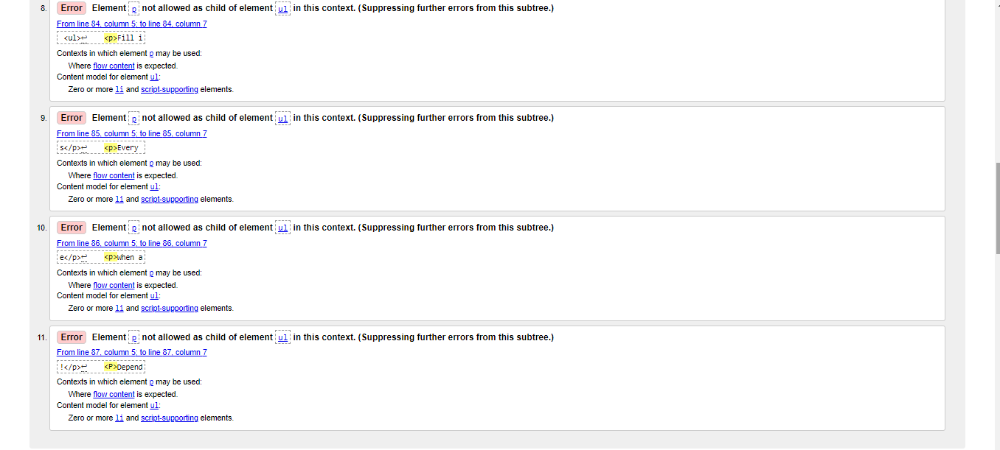
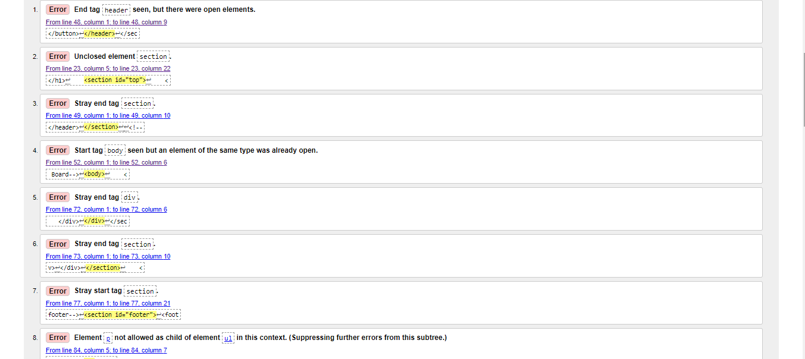
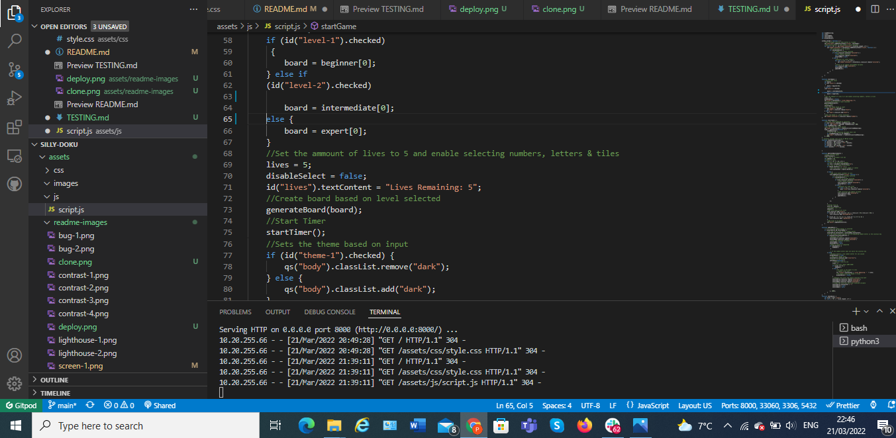
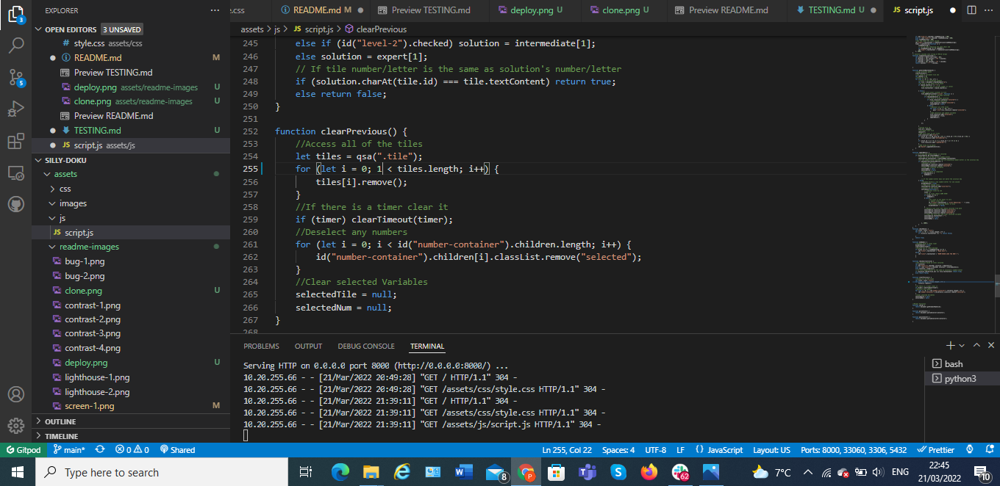
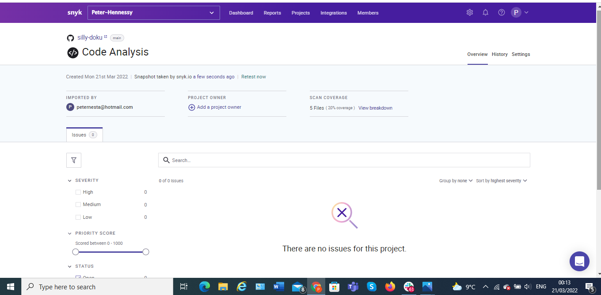
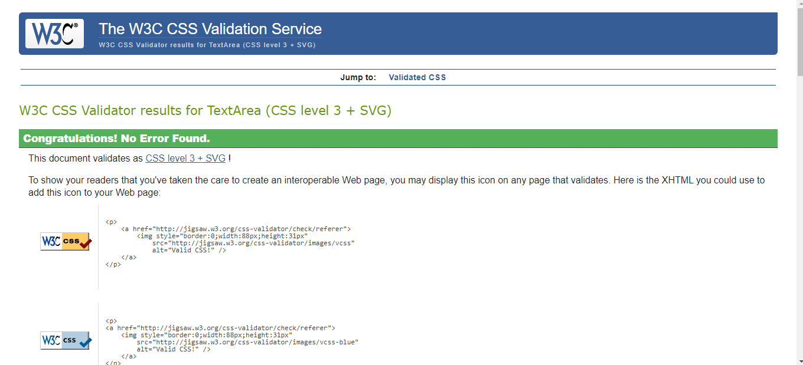
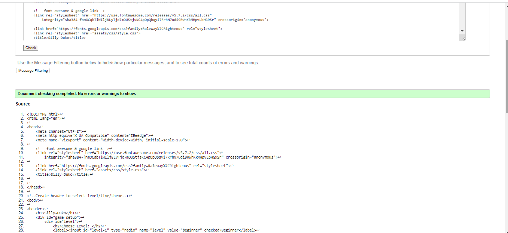
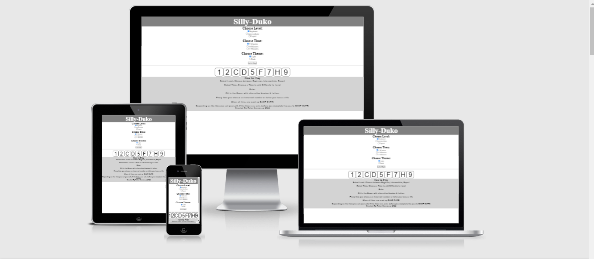
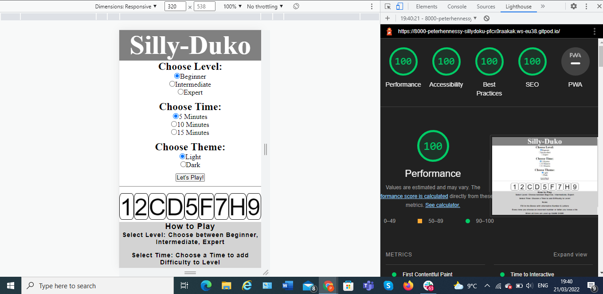
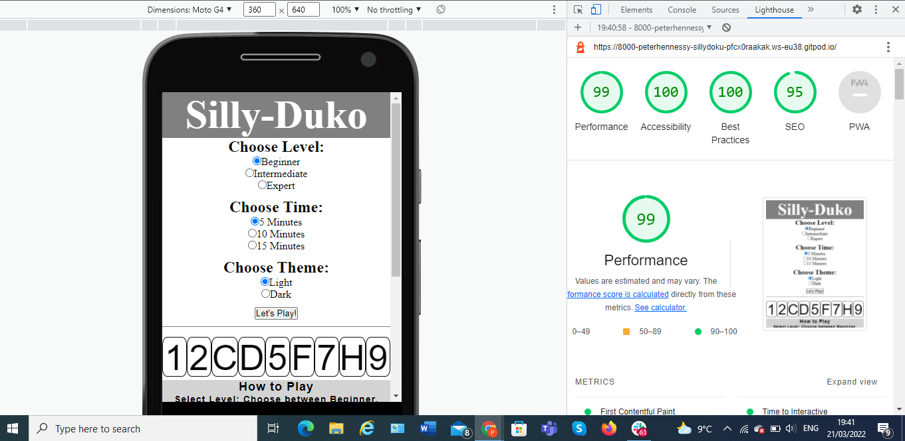

# Testing

## Bugs & Display Errors

- Corrected errors and  ran validator test and post results below

# Bugs during project build

### During the process a lot of the bugs I encountered were down to errors in coding 
- The Board would not appear, this was because of an incorrect command, due to a typo error

#### Images not displaying

   - This was down to inadequate file paths, corrected the error

## Code Validation

- The SILLY-DUKO site has been thoroughly tested. All the code has been run through the [W3C html Validator](https://validator.w3.org/) and the [W3C CSS Validator](https://jigsaw.w3.org/css-validator/).[js Validator](https://snyk.io/)  some errors were found on the HTML, But both the Java Script and CSS returned a clear verdict. 
- I used **Console** in the  [Chrome Dev Tools](https://developer.chrome.com/docs/devtools/) to check the JavaScript, found 2 typo on line **63-65 & line 255**
 

# Validation

## Browser Compatibility

SILLY-DUKO site was tested on the following browsers with no visible issues for the user.
Google Chrome, Microsoft Edge, Safari and Mozilla Firefox. Appearance, Functionality, and Responsiveness were consistent throughout for a range of device sizes and browsers.

## Responsiveness Test

### Biggest Bug
- The biggest issue I had with completing this project was the responsiveness of the board, I tried to style it through **Media Queries** but the board consistently broke, eventually I Used [Grid](https://css-tricks.com/snippets/css/complete-guide-grid/), and this solved the issue

* The Visual Responsiveness was done on [Am I Responsive](http://ami.responsivedesign.is/)

* The responsive design tests were carried out manually with [Google Chrome DevTools](https://developer.chrome.com/docs/devtools/) and [Responsive Design Checker](https://www.responsivedesignchecker.com/).

|        | Moto G4 | Galaxy S5 | iPhone 5 | iPad | iPad Pro | Display <1200px | Display >1200px |
|--------|---------|-----------|----------|------|----------|-----------------|-----------------|
| Render | pass    | pass      | pass     | pass | pass     | pass            | pass            |
| Images | pass    | pass      | pass     | pass | pass     | pass            | pass            |
| Links  | pass    | pass      | pass     | pass | pass     | pass            | pass            |

# Testing User Stories

- ### As a user I want to be able to be drawn into the page
On opening the page the user is drawn to the layout of the game, the name is clearly displayed at the top of the page, the level, time are situated below this, the rules are clearly stated at the footer of the page, and and there is a button with the request **Let's Play**

    

- ### As a user I need to be able to see clearly understand what I need to do 
The rules of the game are displayed clearly at the foot of the page with clear radio buttons at the top of the page to select and then start the game

 

- ### As a user I need to be able to see text and images clearly
All font style and size are clear and taraditional black & white conatratsting on the screen 

  

- ### As a user I need to be able to understand the rules of the game
The rules are simply explained in relation to time and lives, If the time runs out GAME OVER!!! If all 5 lives are used GAME OVER!!!

 

- ###  As A user I need to want to return to the game after the initial game is finished
The game allows the user to beat their personnal best, be that in time or level. which will encourage the user to return to the game

## Additional Testing

### Lighthouse
-The site was also tested using [Google Lighthouse](https://developers.google.com/web/tools/lighthouse) in Chrome Developer Tools to test each of the pages for:

- Performance - How the page performs whilst loading.
- Accessibility - Is the site accessible for all users and how can it be improved.
- Best Practices - Site conforms to industry best practices.
- SEO - Search engine optimisation. Is the site optimised for search engine result rankings.

# Desktop

# Mobile

### _I found doing this in Incognito browser window, gave a more accurate result without background interference_

### Peer review

Return to [README.md](./README.md#testing).

[Top](#testing)

